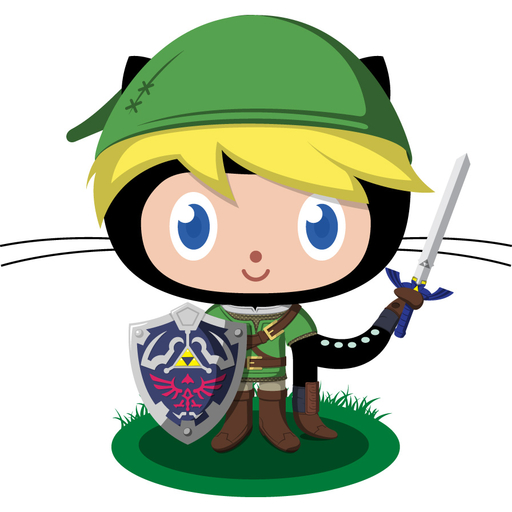

----

**Welcome to my home page**

 
*LinktoCat by [cameronmcefee](http://github.com/cameronmcefee/)*

I am a second-year master's student at the UCSB Bren School of Environmental Science and management. 

My graduate work is focused on database management for improved applicability and usability of citizen science. [Check out my project!](http://seatizenscience.org) 

I'm also a fellow at the National Center for Ecological Analysis and Synthesis, working on the [Ocean Health Index (OHI)](http://ohi-science.org/ohi-global) project and the 2019 global assessment.
